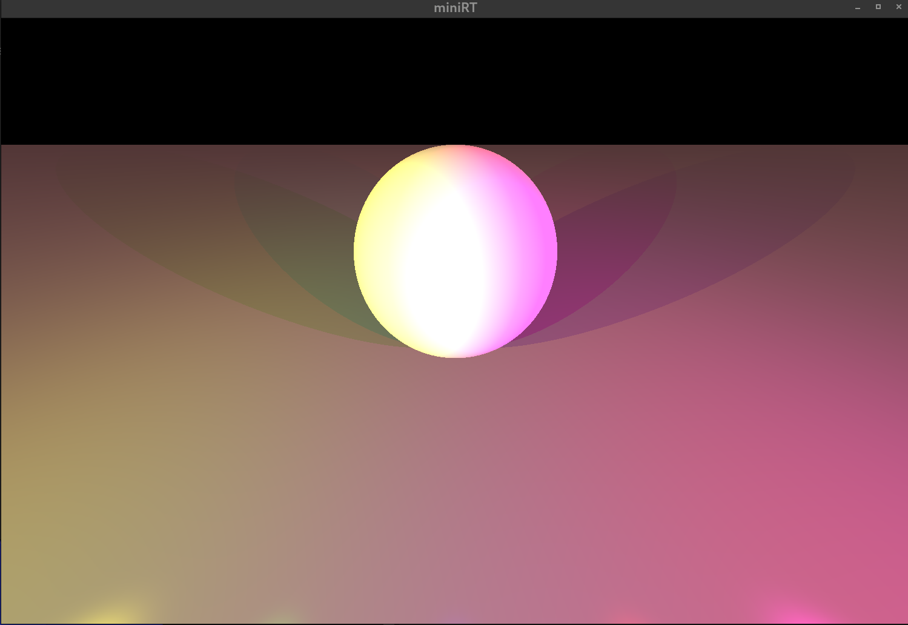

# MiniRT: A Ray-Tracer project
MiniRT is a C project that implements ray-tracing algorithm using the MLX42 graphics library. The program generates images of scenes defined in `.rt` files by rendering simple geometric shapes with lighting and transformation capabilities.

## Features
- Objects:
  - **Planes** (`pl`): Infinite planes with customizable colors.
  - **Spheres** (`sp`): Adjustable by center location, diameter, and color.
  - **Cylinders** (`cy`): Configurable by position, axis, diameter, height, and color.
  - **Cone** (`co`): Configurable by position, axis, diameter, height, and color.

- **Scene**:
  - Ambient and diffuse lighting.
  - Shadows.
  - Phong reflection model.
  - Multiple light sources with different colours.
  - Chekerboard pattern for objects.
  - Camera and object movement.
 
## Installation
Clone the repository and make
```
git clone https://github.com/xrierac/minirt.git
cd minirt
make // (or rather make bonus for all features)
./miniRT scenes/example.rt
```
## Scene Description Format
Scene files define the objects, lights, and camera in the scene using a strict syntax. Below is a breakdown of the available elements:

### General Format
- One element per line.
- Elements can be in any order, separated by line breaks.
- Each element starts with a type identifier followed by its properties.

### Example
```txt
A 0.2 255,255,255       # Ambient light
C -50,0,20 0,0,1 70     # Camera
L -40,50,0 0.6 255,255,255 # Light

pl 0,0,0 0,1.0,0 255,0,225   # Plane
sp 0,0,20 20 255,0,0         # Sphere
cy 50.0,0.0,20.6 0,0,1.0 14.2 21.42 10,0,255 # Cylinder
```
### Example images




If you receive the message MiniRT not responding the program is probably still rendering and we suggest you to wait. 

## Credits
- Developed by: @eleekku & @xrierac
- Built using:
  - **MLX42** ([https://github.com/codam-coding-college/MLX42])
- Inspired by the Ray Tracing Challenge written by James Buck
